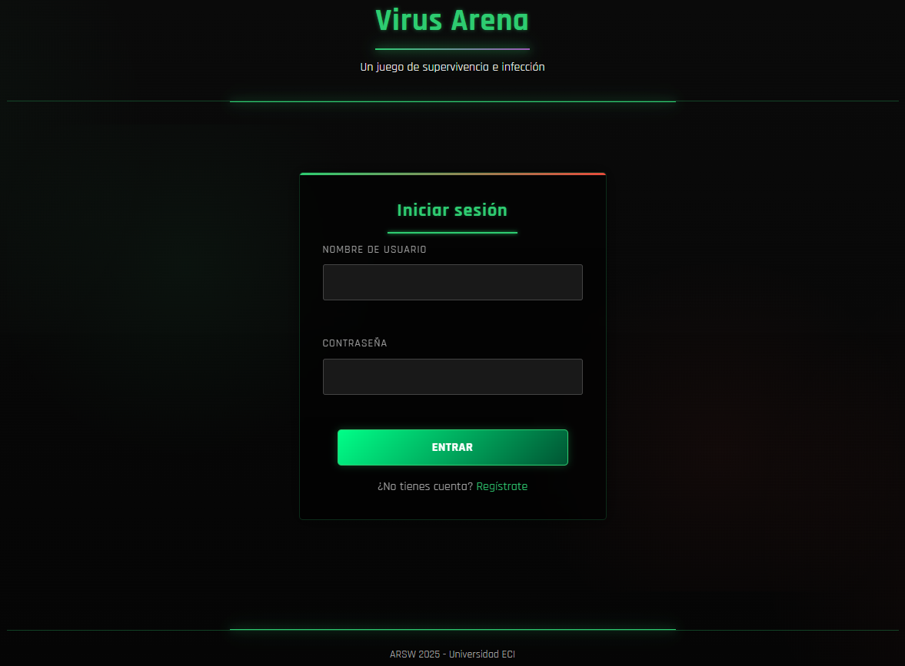
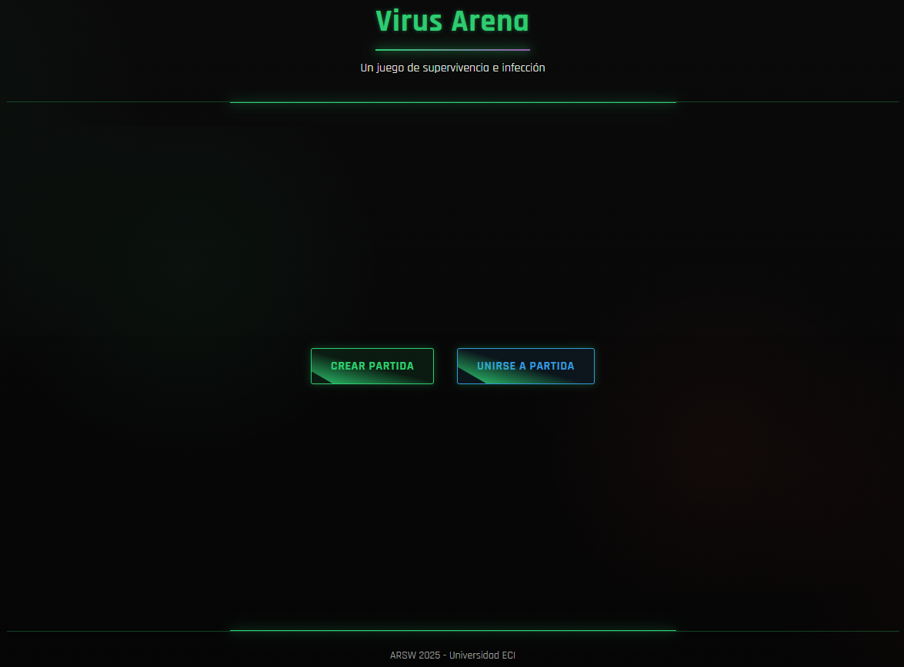
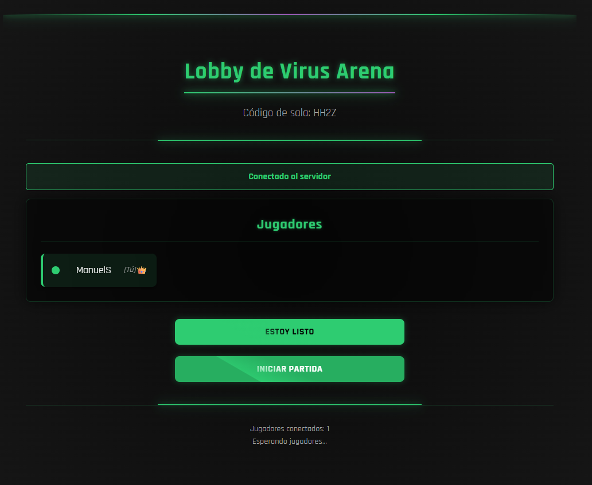
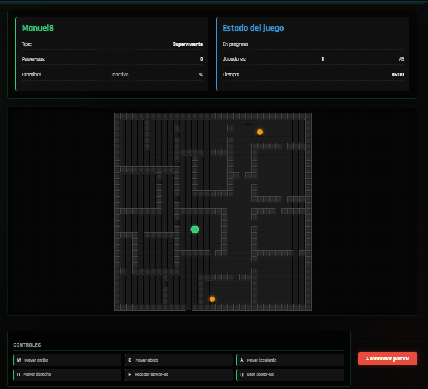

# 🎮 VirusArena Frontend

**VirusArena Frontend** is a dynamic multiplayer game interface built with modern web technologies, featuring real-time gameplay, sleek cyberpunk aesthetics, and responsive design.

---

## 🌟 Features

- 🎨 **Cyberpunk UI** with neon effects and grid layouts
- ⚡ **Real-time Updates** via STOMP over WebSockets
- 🕹️ **Interactive Game Board** with animated cells
- 📱 **Fully Responsive** for all device sizes
- 🔐 **JWT Authentication** flow
- 🏆 **Game Results** with winner highlights

---

## 🖥️ Tech Stack


---

## 🎨 UI Components

### Game Screens
| Screen                          | Description                                   |
|---------------------------------|-----------------------------------------------|
|       | Secure JWT authentication                     |
|  | Player options to create or join a game       |
|       | Player waiting area with ready states         |
|         | Interactive 33x33 grid with real-time updates |

### Key Visual Elements
- **Neon Glow Effects** using CSS filters and box-shadows
- **Animated Grid Background** with subtle scanlines
- **Pulse Animations** for active game elements
- **Cyberpunk Color Palette** (neon green, purple, orange)

---

## 🏗️ Project Structure

```bash
VirusArena-ARSW-2025-1-Frontend/
├── css/
│   ├── game.css       # Game screen styles
│   ├── index.css      # Login/register styles
│   ├── lobby.css      # Lobby screen styles
│   ├── results.css    # Results screen styles
│   └── styles.css     # Global styles
├── js/
│   ├── game.js        # Game logic
│   ├── index.js       # Authentication
│   ├── lobby.js       # Lobby management
│   ├── results.js     # Results display
│   ├── socket.js      # WebSocket wrapper
│   └── ui.js          # UI controllers
├── index.html         # Entry point
├── game.html          # Game screen
├── lobby.html         # Lobby screen
└── results.html       # Results screen
```

---

## 🚀 Getting Started

### Prerequisites
- Modern browser (Chrome/Firefox/Edge)
- Node.js (for development)

### Installation
1. Clone the repository:
```bash
git clone https://github.com/your-username/VirusArena-ARSW-2025-1-Frontend.git
```

2. Open in browser:
```bash
open index.html
```

### Development
For live reload during development:
```bash
npx live-server
```

---

## 🌐 Backend Integration

Connects to the **VirusArena Backend** via:
- REST API for authentication (`/api/auth`)
- WebSockets for real-time gameplay (`/ws`)
- STOMP protocol for pub/sub messaging

---

## 🎮 Game Controls

| Key | Action |
|-----|--------|
| WASD/Arrows | Movement |
| E | Collect power-up |
| Q | Use power-up |
| Space | (Mobile alternative) |

---

## 📱 Responsive Design

- **Desktop**: Full grid view with side panels
- **Tablet**: Compact controls
- **Mobile**: Vertical layout with touch controls

---

## 📜 License

MIT License - see [LICENSE](LICENSE) for details.

---

## ✨ Authors
### **VirusArena Project – ARSW 2025**
#### Developed by DuskBorn Devs
- Manuel Suarez / [@ManuelSuarez07](https://github.com/ManuelSuarez07)
- Yeltzyn Sierra / [@YeltzynS](https://github.com/YeltzynS)

---

> "In the neon grid of VirusArena, only the quickest survive..."